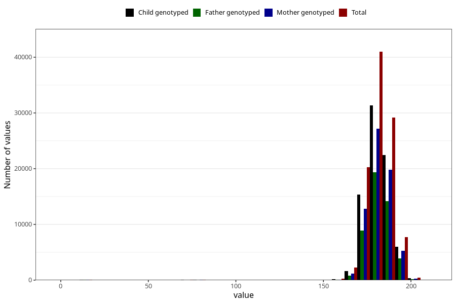

# father_height
Variable mapping to questionnaire: q1m, question AA88.
- Number of values:

| Value | Total | Child genotyped | Mother genotyped | Father genotyped |
| ----- | ----- | --------------- | ---------------- | ---------------- |
| Missing | 12223 | 5977 | 4891 | 2791 |
| Non-missing | 101400 | 77378 | 66878 | 47427 |
| 25th percentile | 177 | 178 | 178 | 178 |
| 50th percentile | 181 | 181 | 182 | 182 |
| 75th percentile | 186 | 186 | 186 | 186 |

