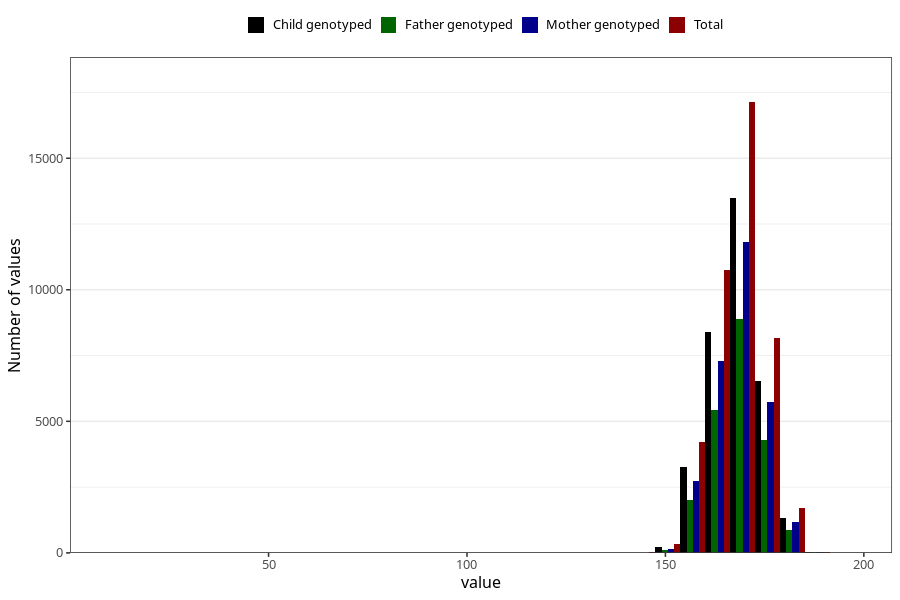

# mother_height_8y
Variable mapping to questionnaire: q9, question NN283.
- Number of values:

| Value | Total | Child genotyped | Mother genotyped | Father genotyped |
| ----- | ----- | --------------- | ---------------- | ---------------- |
| Missing | 71242 | 50026 | 42812 | 28586 |
| Non-missing | 42381 | 33329 | 28957 | 21632 |
| 25th percentile | 164 | 164 | 164 | 164 |
| 50th percentile | 168 | 168 | 168 | 168 |
| 75th percentile | 172 | 172 | 172 | 172 |

