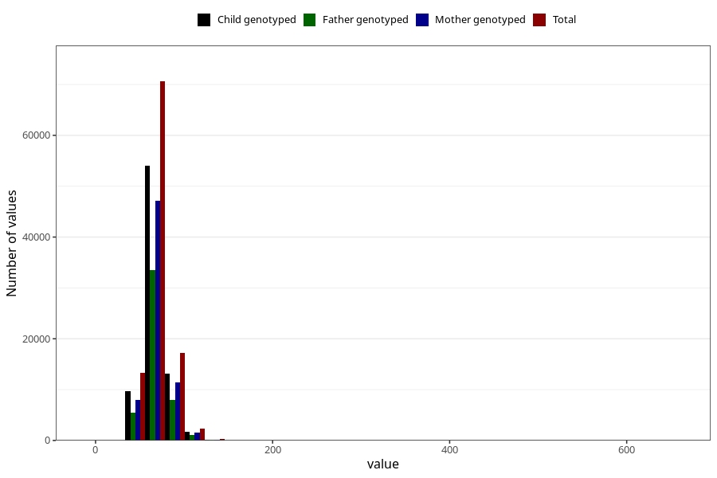

# mother_median_weight
- Number of values:

| Value | Total | Child genotyped | Mother genotyped | Father genotyped |
| ----- | ----- | --------------- | ---------------- | ---------------- |
| Missing | 9991 | 4598 | 3718 | 2156 |
| Non-missing | 103632 | 78757 | 68051 | 48062 |
| 25th percentile | 60 | 60 | 60 | 60.1 |
| 50th percentile | 66.5 | 67 | 67 | 67 |
| 75th percentile | 75 | 75 | 75 | 75 |

