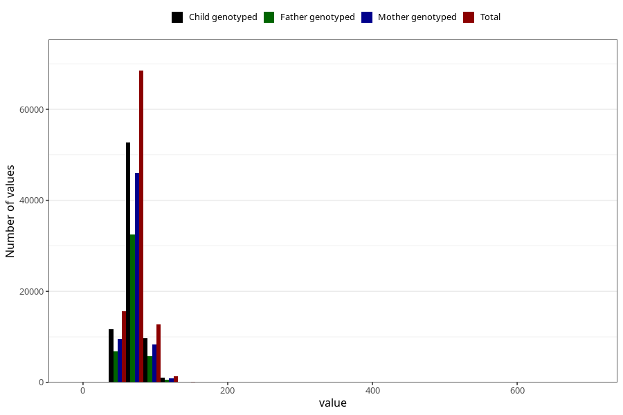

# mother_weight_15w
Variable mapping to questionnaire: q1m, question AA86.
- Number of values:

| Value | Total | Child genotyped | Mother genotyped | Father genotyped |
| ----- | ----- | --------------- | ---------------- | ---------------- |
| Missing | 15302 | 8218 | 6854 | 4369 |
| Non-missing | 98321 | 75137 | 64915 | 45849 |
| 25th percentile | 62 | 62 | 63 | 62 |
| 50th percentile | 69 | 69 | 69 | 69 |
| 75th percentile | 77 | 77 | 77 | 77 |

