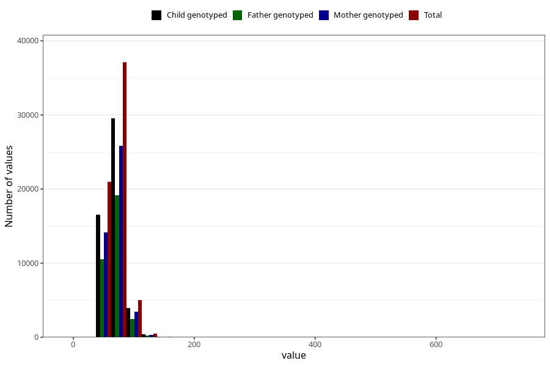

# mother_weight_18m
Variable mapping to questionnaire: q5, question EE924.
- Number of values:

| Value | Total | Child genotyped | Mother genotyped | Father genotyped |
| ----- | ----- | --------------- | ---------------- | ---------------- |
| Missing | 49927 | 32868 | 27907 | 17793 |
| Non-missing | 63696 | 50487 | 43862 | 32425 |
| 25th percentile | 60 | 60 | 60 | 60 |
| 50th percentile | 67 | 67 | 67 | 67 |
| 75th percentile | 76 | 76 | 76 | 76 |

