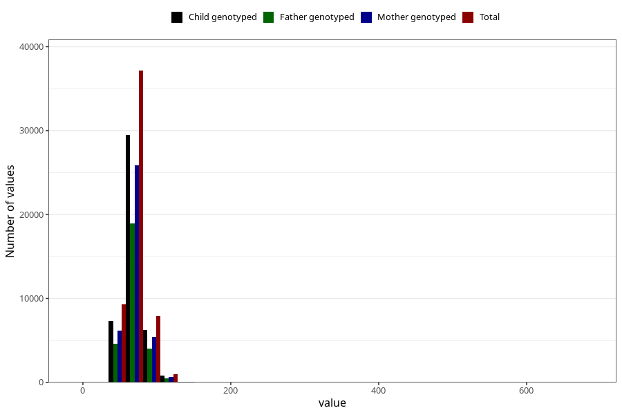

# mother_weight_3y
Variable mapping to questionnaire: q6, question GG501.
- Number of values:

| Value | Total | Child genotyped | Mother genotyped | Father genotyped |
| ----- | ----- | --------------- | ---------------- | ---------------- |
| Missing | 58167 | 39383 | 33501 | 22119 |
| Non-missing | 55456 | 43972 | 38268 | 28099 |
| 25th percentile | 61 | 61 | 61 | 61 |
| 50th percentile | 68 | 68 | 68 | 68 |
| 75th percentile | 76 | 76 | 76 | 76 |

