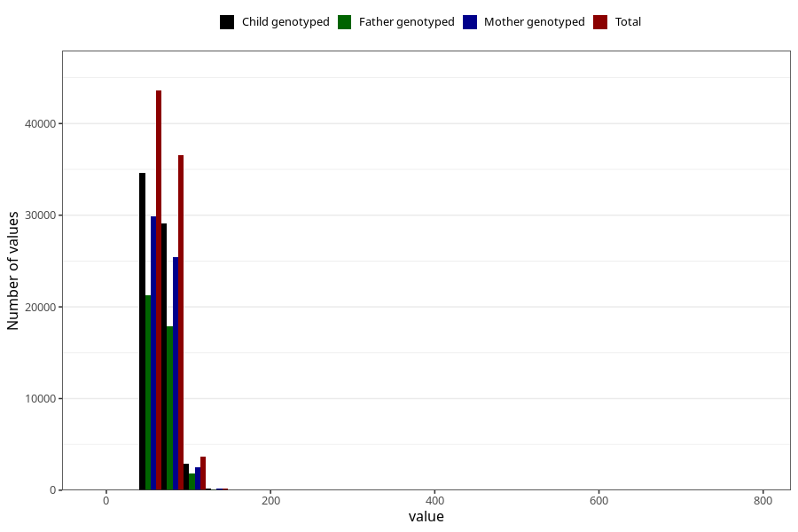

# mother_weight_6m
Variable mapping to questionnaire: q4, question DD673.
- Number of values:

| Value | Total | Child genotyped | Mother genotyped | Father genotyped |
| ----- | ----- | --------------- | ---------------- | ---------------- |
| Missing | 29494 | 16489 | 13672 | 9089 |
| Non-missing | 84129 | 66866 | 58097 | 41129 |
| 25th percentile | 60 | 60 | 60 | 60 |
| 50th percentile | 67 | 67 | 67 | 67 |
| 75th percentile | 75 | 75 | 75 | 75 |

