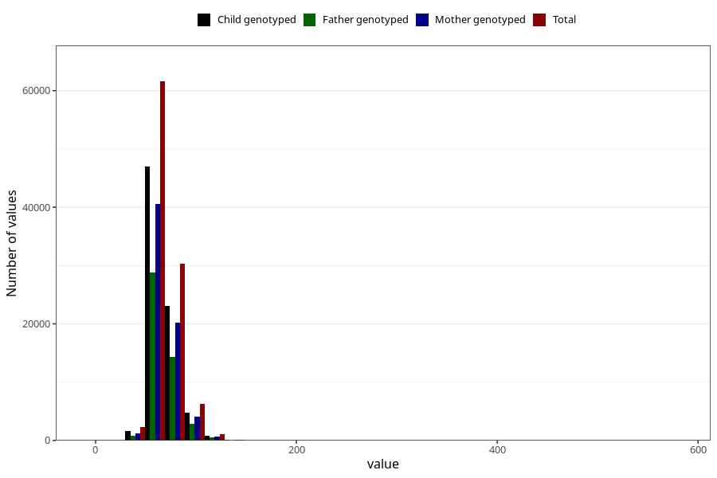

# mother_weight_beginning
Variable mapping to questionnaire: mfr, question MORS_VEKT_FOER.
- Number of values:

| Value | Total | Child genotyped | Mother genotyped | Father genotyped |
| ----- | ----- | --------------- | ---------------- | ---------------- |
| Missing | 11909 | 5974 | 4919 | 2988 |
| Non-missing | 101714 | 77381 | 66850 | 47230 |
| 25th percentile | 59 | 59 | 60 | 60 |
| 50th percentile | 65 | 65 | 66 | 66 |
| 75th percentile | 74 | 74 | 74 | 74 |

