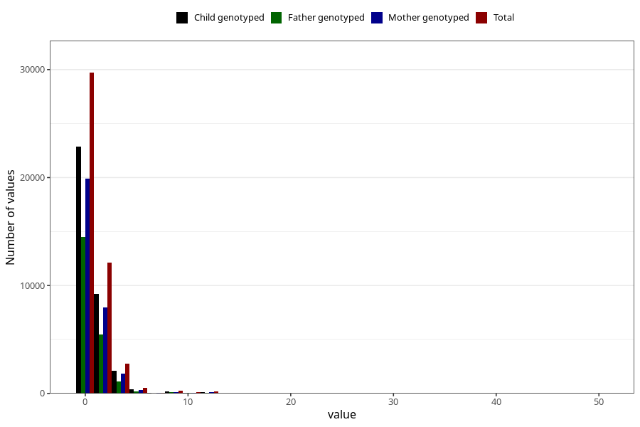

# coke_during
Variable mapping to questionnaire: q1m, question AA1393.
- Number of values:

| Value | Total | Child genotyped | Mother genotyped | Father genotyped |
| ----- | ----- | --------------- | ---------------- | ---------------- |
| Missing | 67925 | 48309 | 41343 | 28715 |
| Non-missing | 45698 | 35046 | 30426 | 21503 |
| Consumption have been reported by a mark but no amount given | 6 | 3 | 3 |1 |
| 25th percentile | 0 | 0 | 0 | 0 |
| 50th percentile | 0 | 0 | 0 | 0 |
| 75th percentile | 1 | 1 | 1 | 1 |

