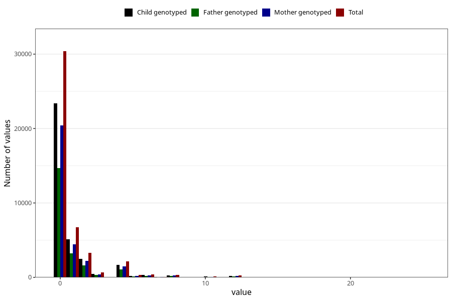

# diet_coke_during
Variable mapping to questionnaire: q1m, question AA1399.
- Number of values:

| Value | Total | Child genotyped | Mother genotyped | Father genotyped |
| ----- | ----- | --------------- | ---------------- | ---------------- |
| Missing | 68772 | 49006 | 41787 | 28636 |
| Non-missing | 44851 | 34349 | 29982 | 21582 |
| Consumption have been reported by a mark but no amount given | 4 | 3 | 1 |0 |
| 25th percentile | 0 | 0 | 0 | 0 |
| 50th percentile | 0 | 0 | 0 | 0 |
| 75th percentile | 1 | 1 | 1 | 1 |

