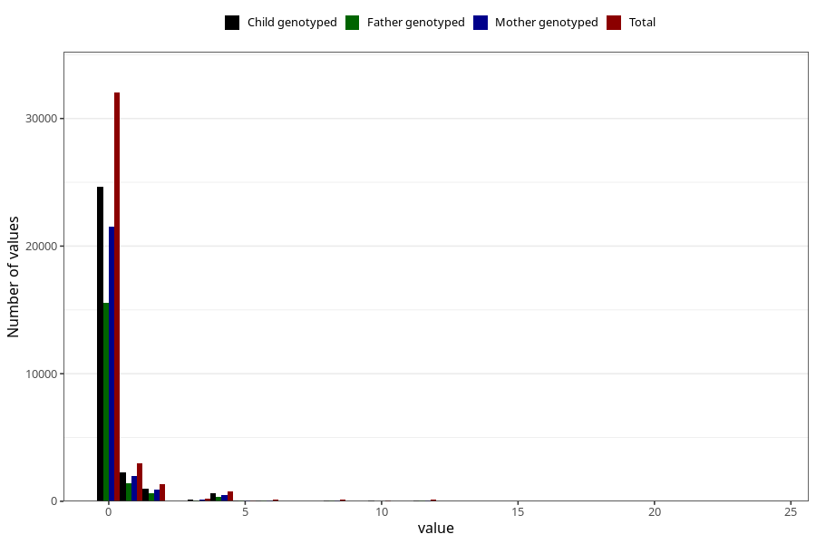

# diet_soda_during
Variable mapping to questionnaire: q1m, question AA1402.
- Number of values:

| Value | Total | Child genotyped | Mother genotyped | Father genotyped |
| ----- | ----- | --------------- | ---------------- | ---------------- |
| Missing | 75819 | 54306 | 46430 | 31971 |
| Non-missing | 37804 | 29049 | 25339 | 18247 |
| Consumption have been reported by a mark but no amount given | 3 | 2 | 2 |1 |
| 0 | 32025 | 24676 | 21557 | 15528 |
| 1 | 2948 | 2254 | 1949 | 1422 |
| 2 | 1366 | 1018 | 883 | 642 |
| 3 | 209 | 158 | 128 | 94 |
| 4 | 783 | 596 | 521 | 348 |
| 5 | 83 | 63 | 54 | 32 |
| 6 | 112 | 76 | 69 | 55 |
| 7 | 14 | 12 | 11 | 9 |
| 8 | 98 | 76 | 64 | 48 |
| 9 | 3 | 3 | 3 | 1 |
| 10 | 43 | 31 | 26 | 13 |
| 12 | 105 | 76 | 66 | 48 |
| 14 | 1 | 0 | 0 | 0 |
| 15 | 1 | 1 | 0 | 0 |
| 16 | 4 | 4 | 3 | 3 |
| 18 | 3 | 1 | 1 | 1 |
| 20 | 2 | 1 | 1 | 1 |
| 24 | 1 | 1 | 1 | 1 |

