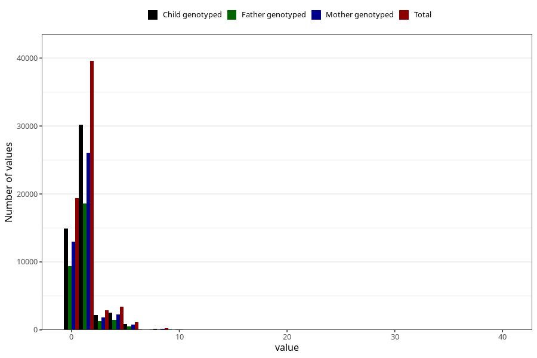

# tea_during
Variable mapping to questionnaire: q1m, question AA1387.
- Number of values:

| Value | Total | Child genotyped | Mother genotyped | Father genotyped |
| ----- | ----- | --------------- | ---------------- | ---------------- |
| Missing | 46803 | 32340 | 27602 | 18802 |
| Non-missing | 66820 | 51015 | 44167 | 31416 |
| Consumption have been reported by a mark but no amount given | 12 | 7 | 6 |5 |
| 25th percentile | 0 | 0 | 0 | 0 |
| 50th percentile | 1 | 1 | 1 | 1 |
| 75th percentile | 2 | 2 | 2 | 2 |

