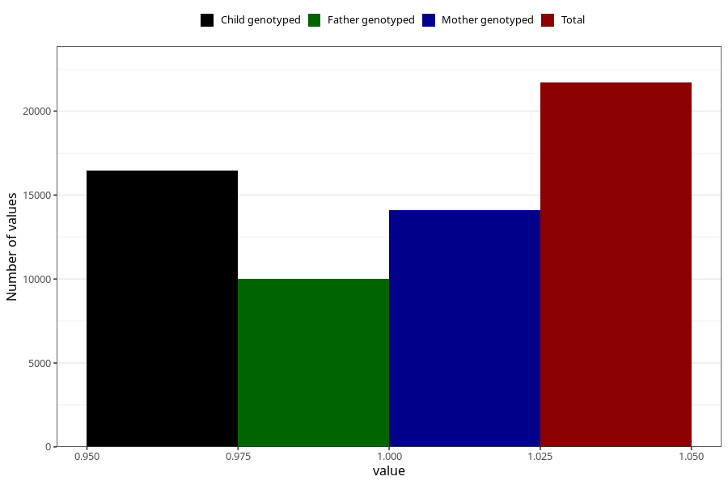

# back_pain_13w_15w
Variable mapping to questionnaire: q1m, question AA199.
- Number of values:

| Value | Total | Child genotyped | Mother genotyped | Father genotyped |
| ----- | ----- | --------------- | ---------------- | ---------------- |
| Missing | 91927 | 66914 | 57671 | 40200 |
| Non-missing | 21696 | 16441 | 14098 | 10018 |
| 1 | 21696 | 16441 | 14098 | 10018 |

