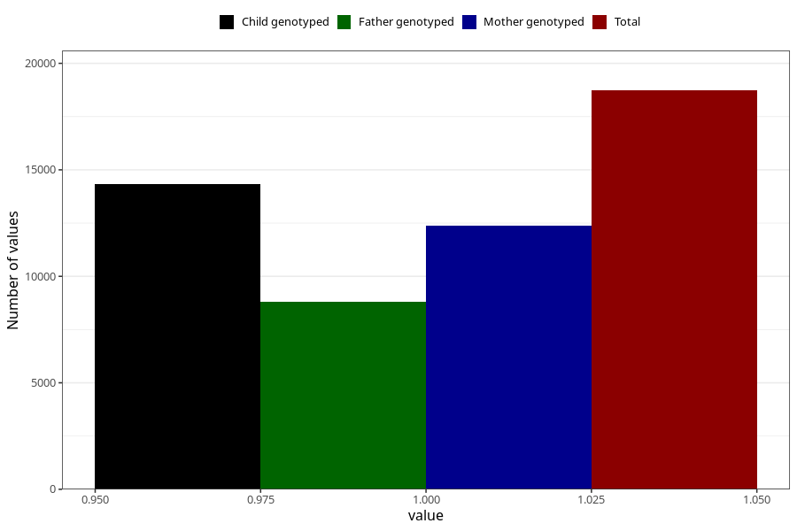

# common_cold_13w_15w
Variable mapping to questionnaire: q1m, question AA349.
- Number of values:

| Value | Total | Child genotyped | Mother genotyped | Father genotyped |
| ----- | ----- | --------------- | ---------------- | ---------------- |
| Missing | 94896 | 69018 | 59378 | 41398 |
| Non-missing | 18727 | 14337 | 12391 | 8820 |
| 1 | 18727 | 14337 | 12391 | 8820 |

