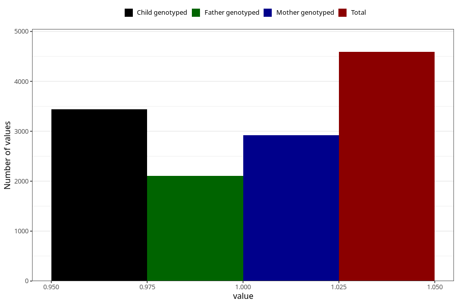

# common_cold_before_4w
Variable mapping to questionnaire: q1m, question AA346.
- Number of values:

| Value | Total | Child genotyped | Mother genotyped | Father genotyped |
| ----- | ----- | --------------- | ---------------- | ---------------- |
| Missing | 109034 | 79916 | 68850 | 48115 |
| Non-missing | 4589 | 3439 | 2919 | 2103 |
| 1 | 4589 | 3439 | 2919 | 2103 |

