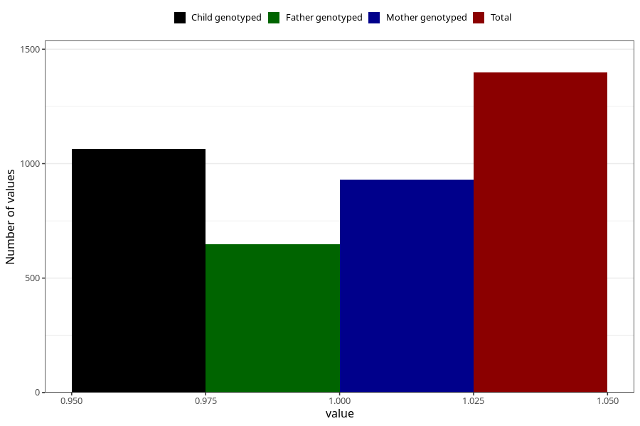

# fever_over385_9w_12w
Variable mapping to questionnaire: q1m, question AA338.
- Number of values:

| Value | Total | Child genotyped | Mother genotyped | Father genotyped |
| ----- | ----- | --------------- | ---------------- | ---------------- |
| Missing | 112225 | 82291 | 70840 | 49570 |
| Non-missing | 1398 | 1064 | 929 | 648 |
| 1 | 1398 | 1064 | 929 | 648 |

