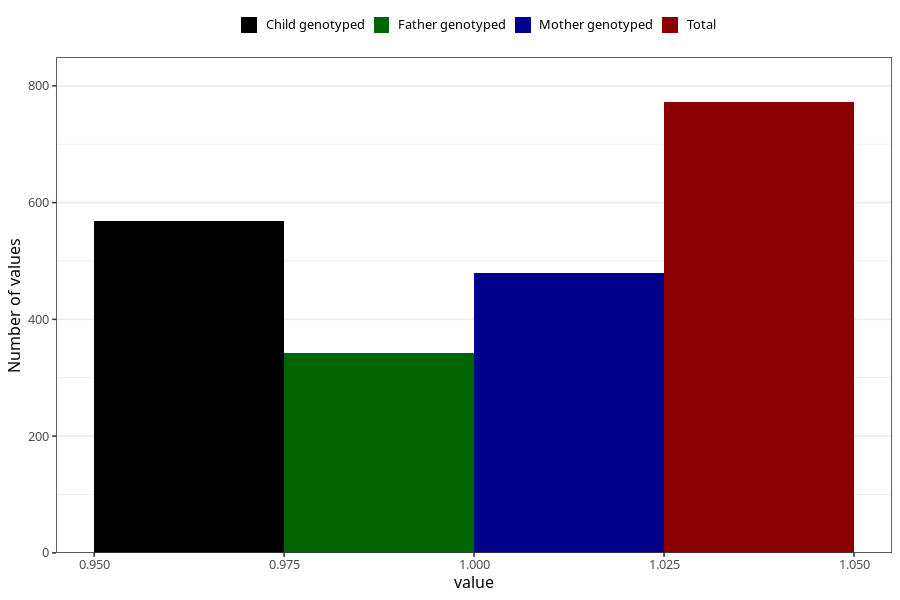

# fever_over385_before_4w
Variable mapping to questionnaire: q1m, question AA336.
- Number of values:

| Value | Total | Child genotyped | Mother genotyped | Father genotyped |
| ----- | ----- | --------------- | ---------------- | ---------------- |
| Missing | 112851 | 82787 | 71290 | 49876 |
| Non-missing | 772 | 568 | 479 | 342 |
| 1 | 772 | 568 | 479 | 342 |

