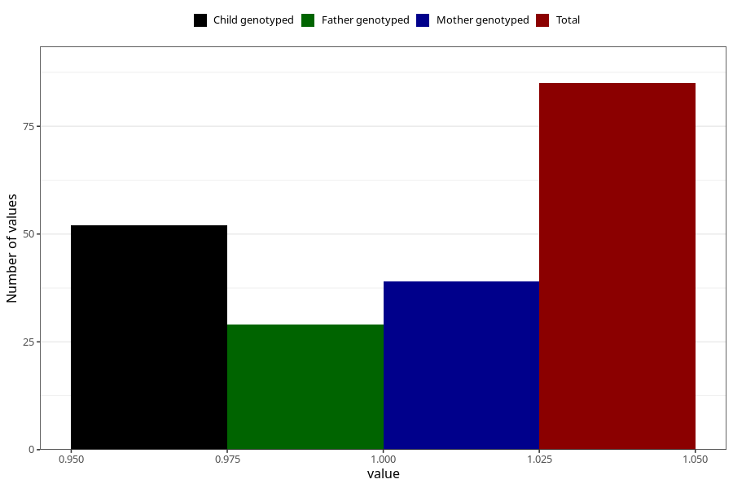

# fever_with_rash_13w_15w
Variable mapping to questionnaire: q1m, question AA329.
- Number of values:

| Value | Total | Child genotyped | Mother genotyped | Father genotyped |
| ----- | ----- | --------------- | ---------------- | ---------------- |
| Missing | 113538 | 83303 | 71730 | 50189 |
| Non-missing | 85 | 52 | 39 | 29 |
| 1 | 85 | 52 | 39 | 29 |

