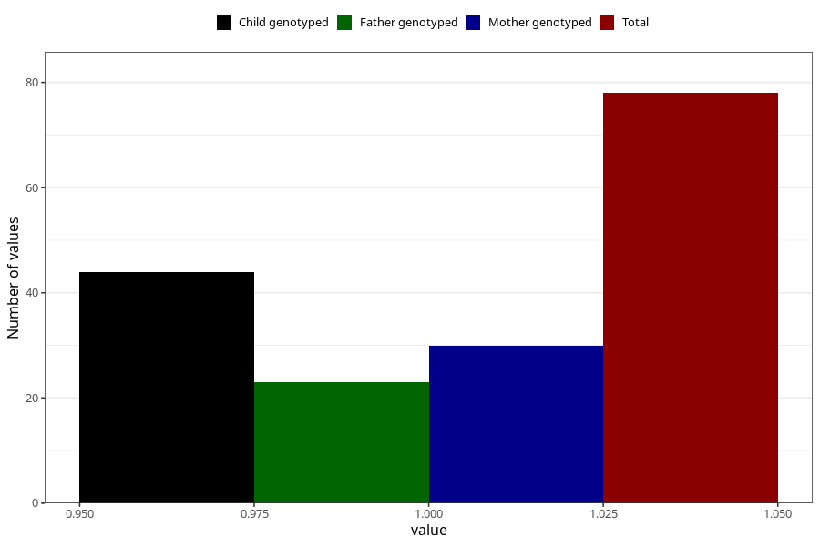

# fever_with_rash_before_4w
Variable mapping to questionnaire: q1m, question AA326.
- Number of values:

| Value | Total | Child genotyped | Mother genotyped | Father genotyped |
| ----- | ----- | --------------- | ---------------- | ---------------- |
| Missing | 113545 | 83311 | 71739 | 50195 |
| Non-missing | 78 | 44 | 30 | 23 |
| 1 | 78 | 44 | 30 | 23 |

