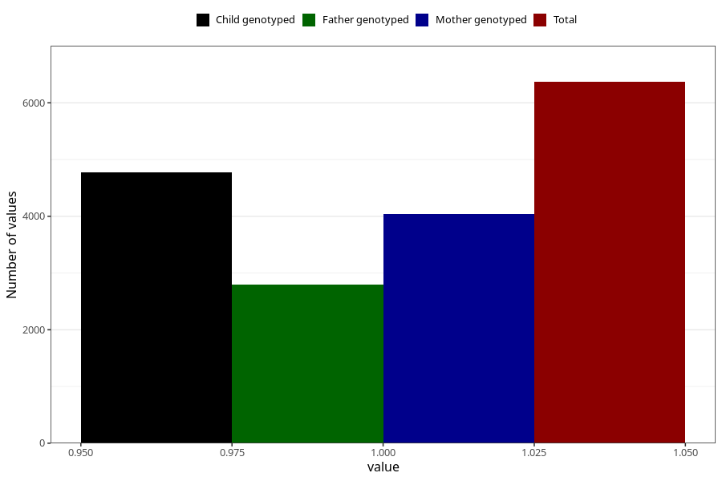

# heartburn_5w_8w
Variable mapping to questionnaire: q1m, question AA307.
- Number of values:

| Value | Total | Child genotyped | Mother genotyped | Father genotyped |
| ----- | ----- | --------------- | ---------------- | ---------------- |
| Missing | 107255 | 78575 | 67730 | 47427 |
| Non-missing | 6368 | 4780 | 4039 | 2791 |
| 1 | 6368 | 4780 | 4039 | 2791 |

