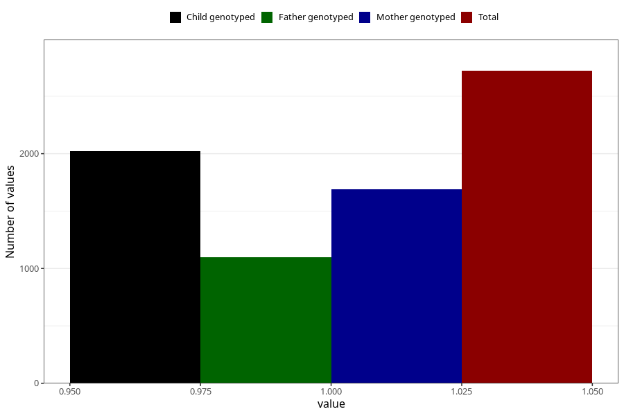

# heartburn_before_4w
Variable mapping to questionnaire: q1m, question AA306.
- Number of values:

| Value | Total | Child genotyped | Mother genotyped | Father genotyped |
| ----- | ----- | --------------- | ---------------- | ---------------- |
| Missing | 110902 | 81334 | 70082 | 49122 |
| Non-missing | 2721 | 2021 | 1687 | 1096 |
| 1 | 2721 | 2021 | 1687 | 1096 |

