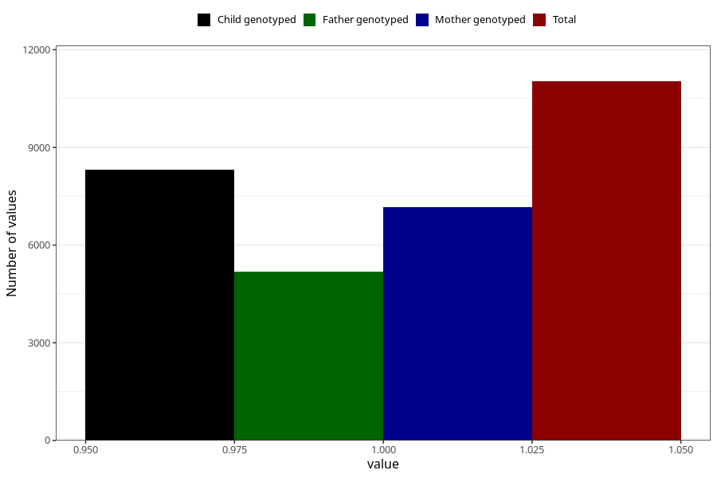

# neck_shoulder_pain_13w_15w
Variable mapping to questionnaire: q1m, question AA209.
- Number of values:

| Value | Total | Child genotyped | Mother genotyped | Father genotyped |
| ----- | ----- | --------------- | ---------------- | ---------------- |
| Missing | 102597 | 75030 | 64612 | 45031 |
| Non-missing | 11026 | 8325 | 7157 | 5187 |
| 1 | 11026 | 8325 | 7157 | 5187 |

