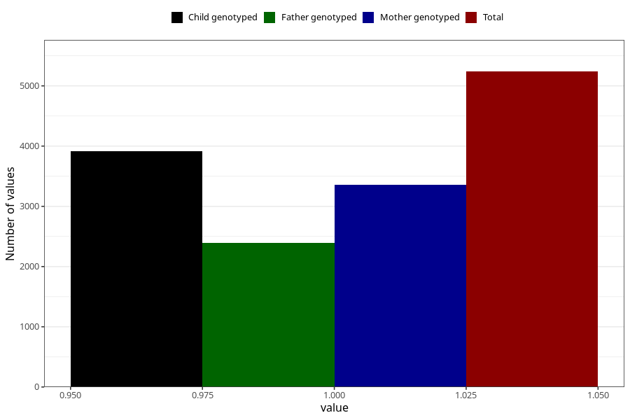

# neck_shoulder_pain_5w_8w
Variable mapping to questionnaire: q1m, question AA207.
- Number of values:

| Value | Total | Child genotyped | Mother genotyped | Father genotyped |
| ----- | ----- | --------------- | ---------------- | ---------------- |
| Missing | 108385 | 79438 | 68406 | 47831 |
| Non-missing | 5238 | 3917 | 3363 | 2387 |
| 1 | 5238 | 3917 | 3363 | 2387 |

