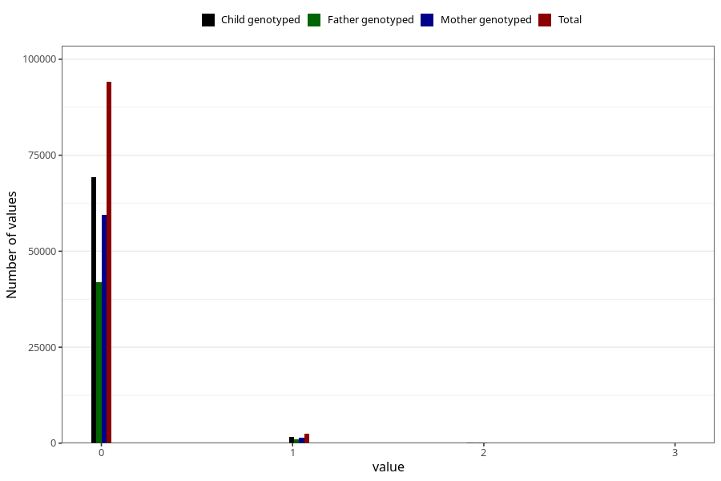

# previous_miscarriages_12_23w
Variable mapping to questionnaire: mfr, question SPABORT_23_5.
- Number of values:

| Value | Total | Child genotyped | Mother genotyped | Father genotyped |
| ----- | ----- | --------------- | ---------------- | ---------------- |
| Missing | 16766 | 12115 | 10535 | 7096 |
| Non-missing | 96857 | 71240 | 61234 | 43122 |
| 4 or more | 43 | 28 | 21 |14 |
| 0 | 94091 | 69293 | 59571 | 41990 |
| 1 | 2422 | 1721 | 1477 | 1001 |
| 2 | 250 | 162 | 138 | 95 |
| 3 | 51 | 36 | 27 | 22 |

