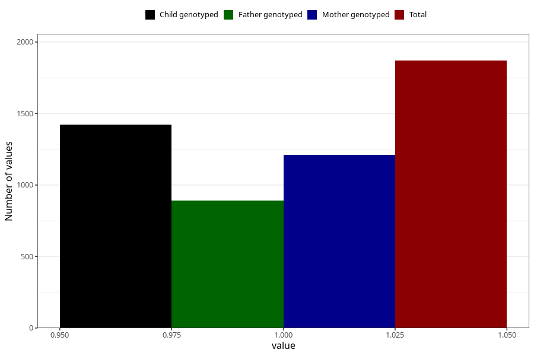

# protein_in_urine_9w_12w
Variable mapping to questionnaire: q1m, question AA408.
- Number of values:

| Value | Total | Child genotyped | Mother genotyped | Father genotyped |
| ----- | ----- | --------------- | ---------------- | ---------------- |
| Missing | 111753 | 81933 | 70557 | 49328 |
| Non-missing | 1870 | 1422 | 1212 | 890 |
| 1 | 1870 | 1422 | 1212 | 890 |

