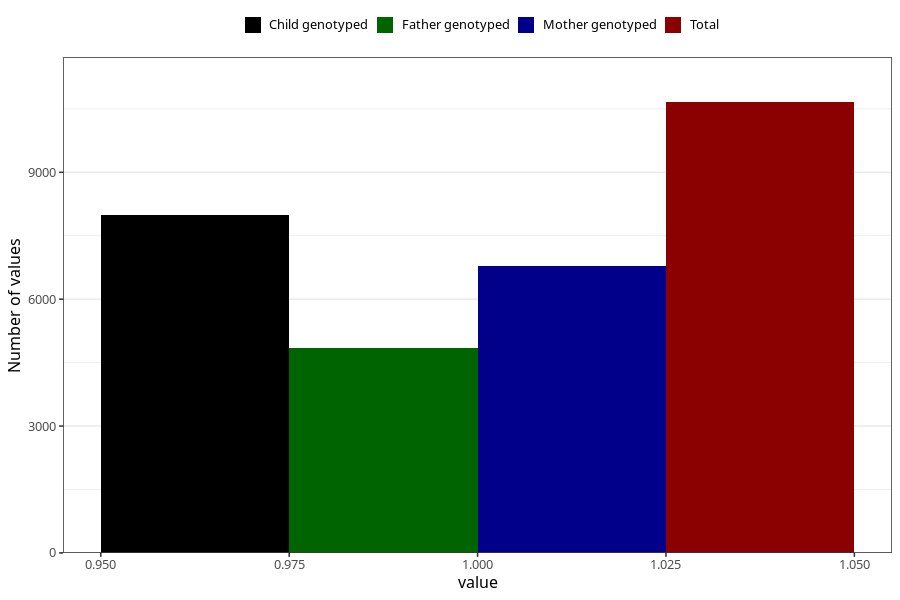

# sleeping_problems_13w_15w
Variable mapping to questionnaire: q1m, question AA299.
- Number of values:

| Value | Total | Child genotyped | Mother genotyped | Father genotyped |
| ----- | ----- | --------------- | ---------------- | ---------------- |
| Missing | 102965 | 75353 | 64987 | 45380 |
| Non-missing | 10658 | 8002 | 6782 | 4838 |
| 1 | 10658 | 8002 | 6782 | 4838 |

