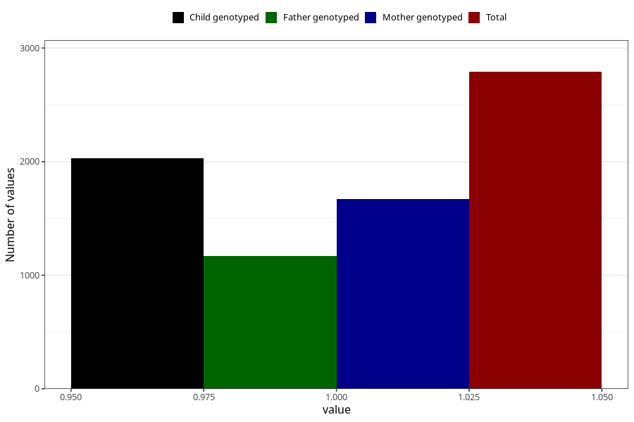

# sleeping_problems_before_4w
Variable mapping to questionnaire: q1m, question AA296.
- Number of values:

| Value | Total | Child genotyped | Mother genotyped | Father genotyped |
| ----- | ----- | --------------- | ---------------- | ---------------- |
| Missing | 110833 | 81323 | 70098 | 49046 |
| Non-missing | 2790 | 2032 | 1671 | 1172 |
| 1 | 2790 | 2032 | 1671 | 1172 |

