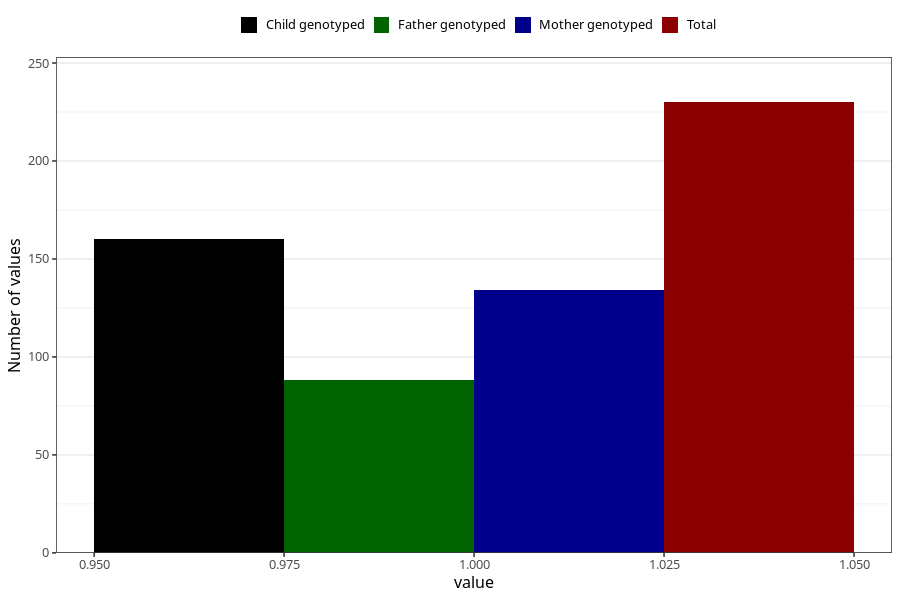

# sugar_in_urine_before_4w
Variable mapping to questionnaire: q1m, question AA396.
- Number of values:

| Value | Total | Child genotyped | Mother genotyped | Father genotyped |
| ----- | ----- | --------------- | ---------------- | ---------------- |
| Missing | 113393 | 83195 | 71635 | 50130 |
| Non-missing | 230 | 160 | 134 | 88 |
| 1 | 230 | 160 | 134 | 88 |

