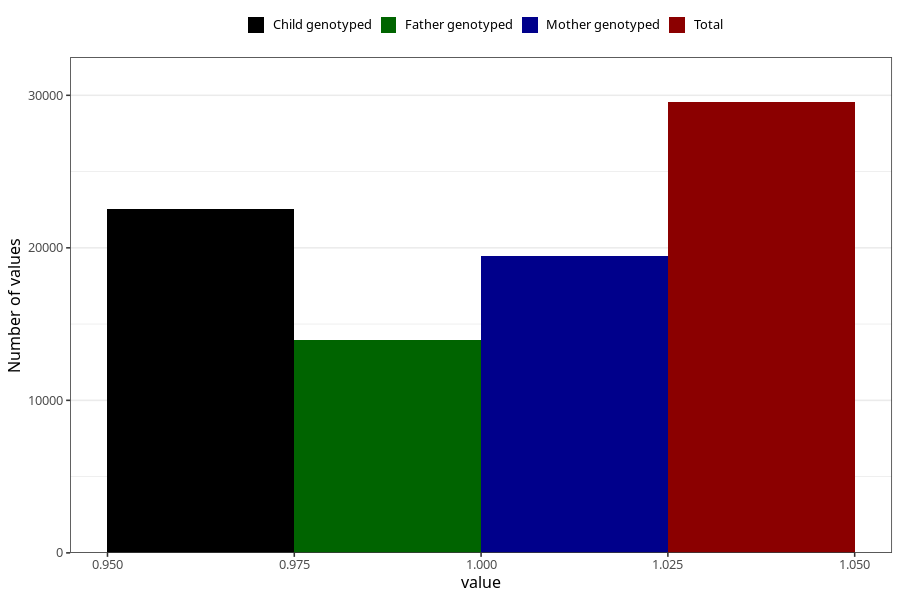

# unusual_tiredness_13w_15w
Variable mapping to questionnaire: q1m, question AA289.
- Number of values:

| Value | Total | Child genotyped | Mother genotyped | Father genotyped |
| ----- | ----- | --------------- | ---------------- | ---------------- |
| Missing | 84076 | 60841 | 52321 | 36269 |
| Non-missing | 29547 | 22514 | 19448 | 13949 |
| 1 | 29547 | 22514 | 19448 | 13949 |

