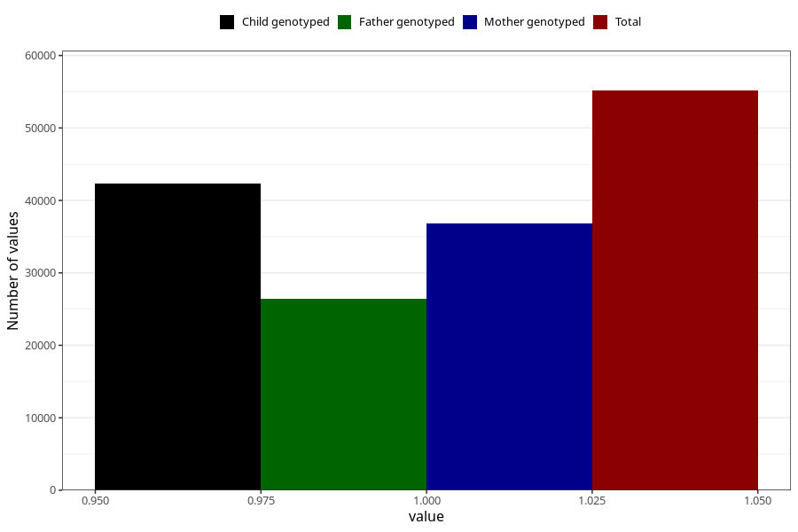

# unusual_tiredness_9w_12w
Variable mapping to questionnaire: q1m, question AA288.
- Number of values:

| Value | Total | Child genotyped | Mother genotyped | Father genotyped |
| ----- | ----- | --------------- | ---------------- | ---------------- |
| Missing | 58469 | 41041 | 34972 | 23790 |
| Non-missing | 55154 | 42314 | 36797 | 26428 |
| 1 | 55154 | 42314 | 36797 | 26428 |

