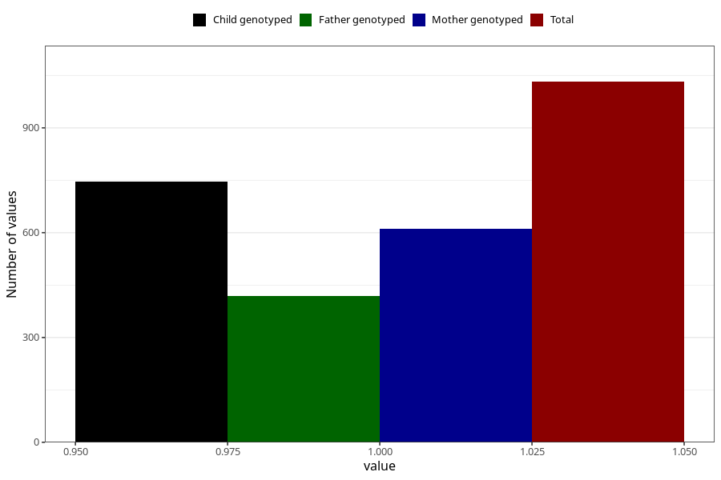

# vaginal_catarrh_unusual_discharge_before_4w
Variable mapping to questionnaire: q1m, question AA246.
- Number of values:

| Value | Total | Child genotyped | Mother genotyped | Father genotyped |
| ----- | ----- | --------------- | ---------------- | ---------------- |
| Missing | 112591 | 82608 | 71159 | 49799 |
| Non-missing | 1032 | 747 | 610 | 419 |
| 1 | 1032 | 747 | 610 | 419 |

