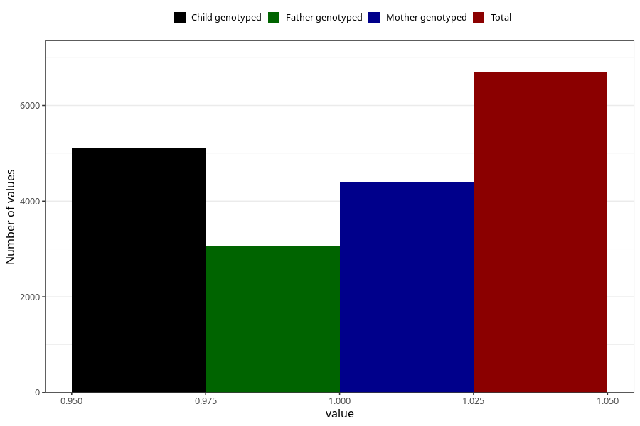

# vaginal_thrush_5w_8w
Variable mapping to questionnaire: q1m, question AA237.
- Number of values:

| Value | Total | Child genotyped | Mother genotyped | Father genotyped |
| ----- | ----- | --------------- | ---------------- | ---------------- |
| Missing | 106936 | 78257 | 67369 | 47144 |
| Non-missing | 6687 | 5098 | 4400 | 3074 |
| 1 | 6687 | 5098 | 4400 | 3074 |

