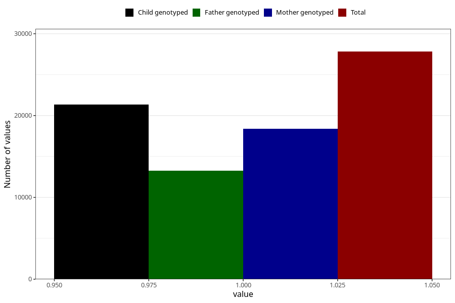

# vomiting_9w_12w
Variable mapping to questionnaire: q1m, question AA228.
- Number of values:

| Value | Total | Child genotyped | Mother genotyped | Father genotyped |
| ----- | ----- | --------------- | ---------------- | ---------------- |
| Missing | 85809 | 62001 | 53379 | 36931 |
| Non-missing | 27814 | 21354 | 18390 | 13287 |
| 1 | 27814 | 21354 | 18390 | 13287 |

