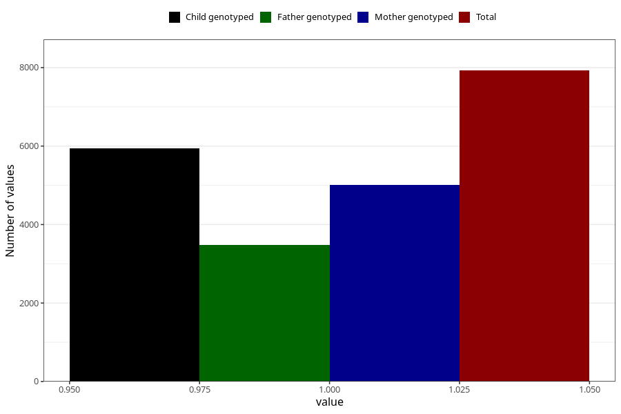

# vomiting_before_4w
Variable mapping to questionnaire: q1m, question AA226.
- Number of values:

| Value | Total | Child genotyped | Mother genotyped | Father genotyped |
| ----- | ----- | --------------- | ---------------- | ---------------- |
| Missing | 105697 | 77411 | 66761 | 46731 |
| Non-missing | 7926 | 5944 | 5008 | 3487 |
| 1 | 7926 | 5944 | 5008 | 3487 |

