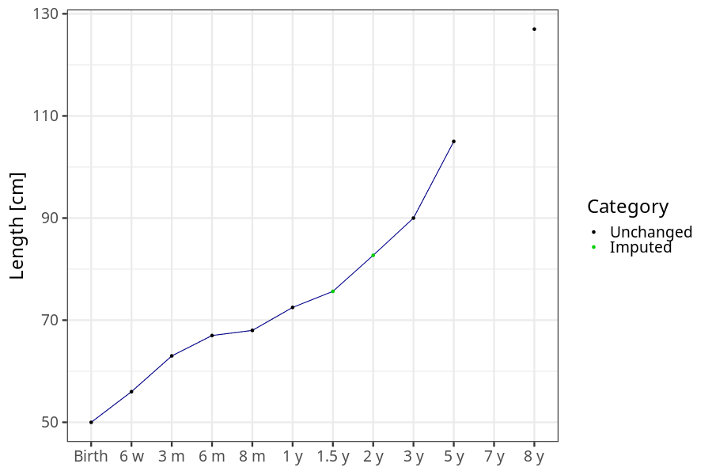
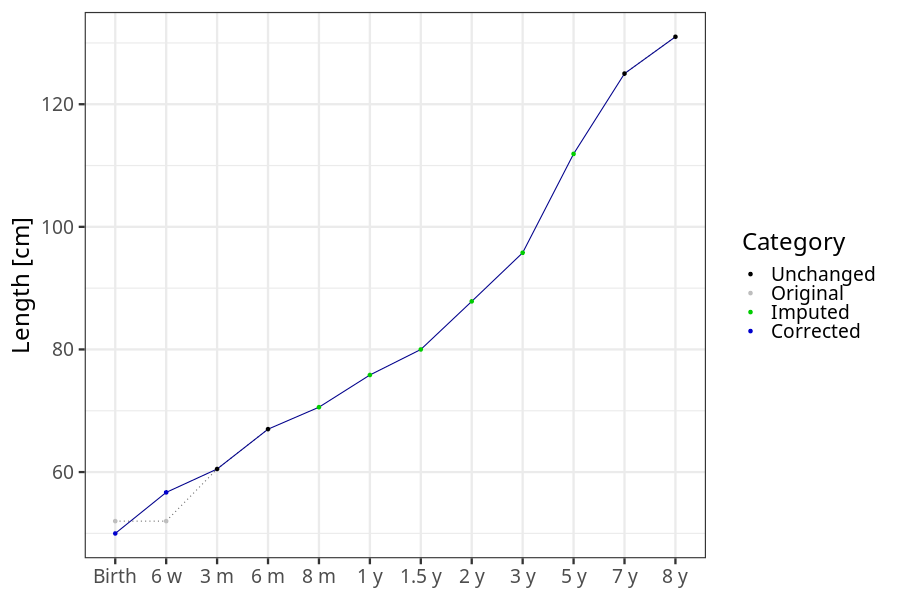

# Phenotypes
### Number of values

### Length vs weight

### Imputation
- Children with no data point altered: 68719
- Children with at least one data point altered: 44904
#### Random example: 19442
> imputed@length_16m imputed@length_2y imputed@weight_16m imputed@weight_2y

#### Random example: 43827
> imputed@length_16m imputed@length_2y imputed@weight_16m imputed@weight_2y

#### Random example: 71625
> imputed@length_16m imputed@length_2y imputed@weight_16m imputed@weight_2y

#### Random example: 78570
> imputed@length_16m imputed@length_2y imputed@weight_16m imputed@weight_2y

#### Random example: 87440
> imputed@length_16m imputed@length_2y imputed@weight_16m imputed@weight_2y

#### Random example: 98596
> imputed@length_16m imputed@length_2y imputed@weight_16m imputed@weight_2y

#### Random example: 3508
> imputed@length_16m imputed@length_2y imputed@weight_16m imputed@weight_2y

#### Random example: 81234
> imputed@length_16m imputed@length_2y imputed@weight_16m imputed@weight_2y

#### Random example: 20109
> imputed@length_16m imputed@length_2y imputed@weight_16m imputed@weight_2y

#### Random example: 59508
> imputed@length_16m imputed@length_2y imputed@weight_16m imputed@weight_2y

#### Random example: 35958
> imputed@length_16m imputed@length_2y imputed@weight_16m imputed@weight_2y

#### Random example: 70141
> imputed@length_16m imputed@length_2y imputed@weight_16m imputed@weight_2y

#### Random example: 28200
> imputed@length_16m imputed@length_2y imputed@weight_16m imputed@weight_2y

#### Random example: 101825
> imputed@length_16m imputed@length_2y imputed@weight_16m imputed@weight_2y

#### Random example: 14587
> imputed@length_16m imputed@length_2y imputed@weight_16m imputed@weight_2y

#### Random example: 6844
> imputed@length_16m imputed@length_2y imputed@weight_16m imputed@weight_2y

#### Random example: 71451
> imputed@length_16m imputed@length_2y imputed@weight_16m imputed@weight_2y

#### Random example: 39340
> imputed@length_16m imputed@length_2y imputed@weight_16m imputed@weight_2y

#### Random example: 53300
> imputed@length_16m imputed@length_2y imputed@weight_16m imputed@weight_2y

#### Random example: 60298
> imputed@length_16m imputed@length_2y imputed@weight_16m imputed@weight_2y

#### Most extreme example (1): 64032
> 

#### Most extreme example (2): 88368
> 

#### Most extreme example (3): 66456
> imputed@length_16m imputed@length_2y imputed@weight_16m imputed@weight_2y

#### Most extreme example (4): 38516
> imputed@length_16m imputed@length_2y imputed@weight_16m imputed@weight_2y

#### Most extreme example (5): 13877
> 

#### Most extreme example (6): 78472
> imputed@length_8m imputed@length_1y imputed@length_16m imputed@weight_8m imputed@weight_1y imputed@weight_16m

#### Most extreme example (7): 105784
> outlier@length_2y imputed@length_2y

#### Most extreme example (8): 31099
> 

#### Most extreme example (9): 59083
> 

#### Most extreme example (10): 111082
> imputed@length_5y imputed@weight_5y

#### Most extreme example (11): 69135
> 

#### Most extreme example (12): 69795
> imputed@weight_6m imputed@weight_8m imputed@weight_16m

#### Most extreme example (13): 74779
> imputed@length_16m imputed@length_2y imputed@weight_16m imputed@weight_2y

#### Most extreme example (14): 81293
> 

#### Most extreme example (15): 85807
> 

#### Most extreme example (16): 92594
> outlier@weight_1y imputed@weight_1y imputed@weight_2y

#### Most extreme example (17): 20675
> 

#### Most extreme example (18): 57725
> 

#### Most extreme example (19): 33539
> imputed@length_16m imputed@length_2y imputed@weight_16m imputed@weight_2y

#### Most extreme example (20): 10953
> 

