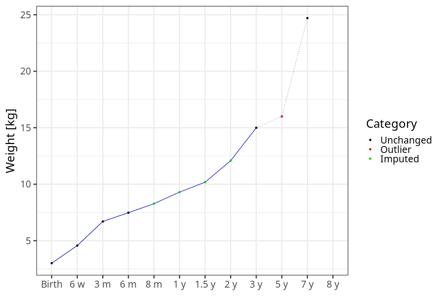
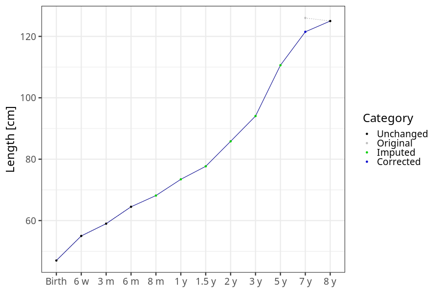
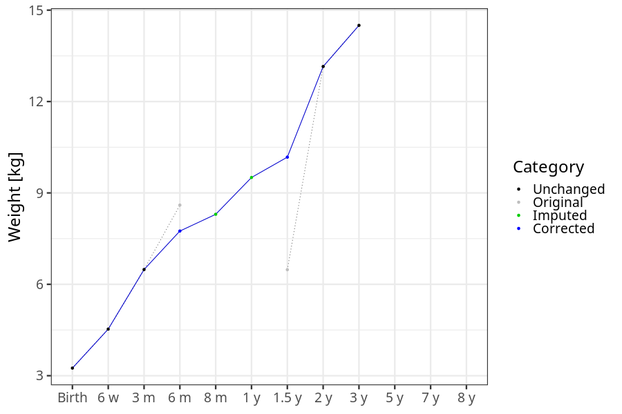

# Phenotypes
### Number of values

### Length vs weight

### Imputation
- Children with no data point altered: 68719
- Children with at least one data point altered: 44904
#### Random example: 69717
> imputed@length_16m imputed@length_2y imputed@weight_16m imputed@weight_2y

#### Random example: 8722
> imputed@length_16m imputed@length_2y imputed@weight_16m imputed@weight_2y

#### Random example: 91467
> imputed@length_16m imputed@length_2y imputed@weight_16m imputed@weight_2y

#### Random example: 59812
> imputed@length_16m imputed@length_2y imputed@weight_16m imputed@weight_2y

#### Random example: 10899
> imputed@length_16m imputed@length_2y imputed@weight_16m imputed@weight_2y

#### Random example: 60051
> imputed@length_16m imputed@length_2y imputed@weight_16m imputed@weight_2y

#### Random example: 93509
> imputed@length_16m imputed@length_2y imputed@weight_16m imputed@weight_2y

#### Random example: 46913
> imputed@length_16m imputed@length_2y imputed@weight_16m imputed@weight_2y

#### Random example: 16649
> imputed@length_16m imputed@length_2y imputed@weight_16m imputed@weight_2y

#### Random example: 16855
> imputed@length_16m imputed@length_2y imputed@weight_16m imputed@weight_2y

#### Random example: 55541
> imputed@length_16m imputed@length_2y imputed@weight_16m imputed@weight_2y

#### Random example: 85408
> imputed@length_16m imputed@length_2y imputed@weight_16m imputed@weight_2y

#### Random example: 59359
> imputed@length_16m imputed@length_2y imputed@weight_16m imputed@weight_2y

#### Random example: 27294
> imputed@length_16m imputed@length_2y imputed@weight_16m imputed@weight_2y

#### Random example: 30018
> imputed@length_16m imputed@length_2y imputed@weight_16m imputed@weight_2y

#### Random example: 70064
> imputed@length_16m imputed@length_2y imputed@weight_16m imputed@weight_2y

#### Random example: 67155
> imputed@length_16m imputed@length_2y imputed@weight_16m imputed@weight_2y

#### Random example: 11776
> imputed@length_16m imputed@length_2y imputed@weight_16m imputed@weight_2y

#### Random example: 23723
> imputed@length_16m imputed@length_2y imputed@weight_16m imputed@weight_2y

#### Random example: 106792
> imputed@length_16m imputed@length_2y imputed@weight_16m imputed@weight_2y

#### Most extreme example (1): 60536
> 

#### Most extreme example (2): 208
> 

#### Most extreme example (3): 47931
> imputed@length_16m imputed@length_2y imputed@weight_16m imputed@weight_2y

#### Most extreme example (4): 1961
> imputed@length_16m imputed@length_2y imputed@weight_16m imputed@weight_2y

#### Most extreme example (5): 77140
> 

#### Most extreme example (6): 28192
> imputed@length_8m imputed@length_1y imputed@length_16m imputed@weight_8m imputed@weight_1y imputed@weight_16m

#### Most extreme example (7): 49558
> outlier@length_2y imputed@length_2y

#### Most extreme example (8): 62193
> 

#### Most extreme example (9): 87022
> 

#### Most extreme example (10): 1102
> imputed@length_5y imputed@weight_5y

#### Most extreme example (11): 71381
> 

#### Most extreme example (12): 22388
> imputed@weight_6m imputed@weight_8m imputed@weight_16m

#### Most extreme example (13): 105757
> imputed@length_16m imputed@length_2y imputed@weight_16m imputed@weight_2y

#### Most extreme example (14): 16865
> 

#### Most extreme example (15): 5141
> 

#### Most extreme example (16): 13546
> outlier@weight_1y imputed@weight_1y imputed@weight_2y

#### Most extreme example (17): 53506
> 

#### Most extreme example (18): 87088
> 

#### Most extreme example (19): 26773
> imputed@length_16m imputed@length_2y imputed@weight_16m imputed@weight_2y

#### Most extreme example (20): 98993
> 

