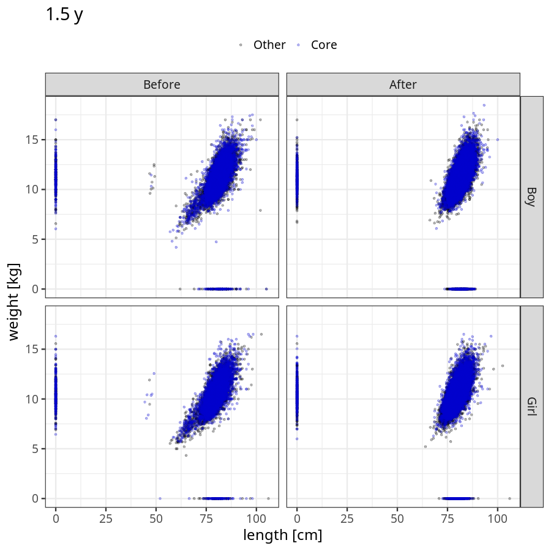

# Phenotypes
### Number of values

### Length vs weight

### Imputation
- Children with no data point altered: 68720
- Children with at least one data point altered: 44903
#### Random example: 86574
> imputed@length_16m imputed@length_2y imputed@weight_16m imputed@weight_2y

#### Random example: 81505
> imputed@length_16m imputed@length_2y imputed@weight_16m imputed@weight_2y

#### Random example: 33509
> imputed@length_16m imputed@length_2y imputed@weight_16m imputed@weight_2y

#### Random example: 100248
> imputed@length_16m imputed@length_2y imputed@weight_16m imputed@weight_2y

#### Random example: 65629
> imputed@length_16m imputed@length_2y imputed@weight_16m imputed@weight_2y

#### Random example: 23547
> imputed@length_16m imputed@length_2y imputed@weight_16m imputed@weight_2y

#### Random example: 99365
> imputed@length_16m imputed@length_2y imputed@weight_16m imputed@weight_2y

#### Random example: 40861
> imputed@length_16m imputed@length_2y imputed@weight_16m imputed@weight_2y

#### Random example: 3700
> imputed@length_16m imputed@length_2y imputed@weight_16m imputed@weight_2y

#### Random example: 97087
> imputed@length_16m imputed@length_2y imputed@weight_16m imputed@weight_2y

#### Random example: 1525
> imputed@length_16m imputed@length_2y imputed@weight_16m imputed@weight_2y

#### Random example: 50377
> imputed@length_16m imputed@length_2y imputed@weight_16m imputed@weight_2y

#### Random example: 77276
> imputed@length_16m imputed@length_2y imputed@weight_16m imputed@weight_2y

#### Random example: 84138
> imputed@length_16m imputed@length_2y imputed@weight_16m imputed@weight_2y

#### Random example: 57472
> imputed@length_16m imputed@length_2y imputed@weight_16m imputed@weight_2y

#### Random example: 77135
> imputed@length_16m imputed@length_2y imputed@weight_16m imputed@weight_2y

#### Random example: 27802
> imputed@length_16m imputed@length_2y imputed@weight_16m imputed@weight_2y

#### Random example: 91813
> imputed@length_16m imputed@length_2y imputed@weight_16m imputed@weight_2y

#### Random example: 56721
> imputed@length_16m imputed@length_2y imputed@weight_16m imputed@weight_2y

#### Random example: 90266
> imputed@length_16m imputed@length_2y imputed@weight_16m imputed@weight_2y

#### Most extreme example (1): 77182
> 

#### Most extreme example (2): 33255
> 

#### Most extreme example (3): 8552
> imputed@length_16m imputed@length_2y imputed@weight_16m imputed@weight_2y

#### Most extreme example (4): 103458
> imputed@length_16m imputed@length_2y imputed@weight_16m imputed@weight_2y

#### Most extreme example (5): 103859
> 

#### Most extreme example (6): 288
> imputed@length_8m imputed@length_1y imputed@length_16m imputed@weight_8m imputed@weight_1y imputed@weight_16m

#### Most extreme example (7): 74565
> outlier@length_2y imputed@length_2y

#### Most extreme example (8): 29326
> 

#### Most extreme example (9): 71876
> 

#### Most extreme example (10): 105751
> imputed@length_5y imputed@weight_5y

#### Most extreme example (11): 101456
> 

#### Most extreme example (12): 59507
> imputed@weight_6m imputed@weight_8m imputed@weight_16m

#### Most extreme example (13): 54079
> imputed@length_16m imputed@length_2y imputed@weight_16m imputed@weight_2y

#### Most extreme example (14): 100277
> 

#### Most extreme example (15): 56407
> 

#### Most extreme example (16): 66759
> outlier@weight_1y imputed@weight_1y imputed@weight_2y

#### Most extreme example (17): 77851
> 

#### Most extreme example (18): 25485
> 

#### Most extreme example (19): 30719
> imputed@length_16m imputed@length_2y imputed@weight_16m imputed@weight_2y

#### Most extreme example (20): 76837
> 

