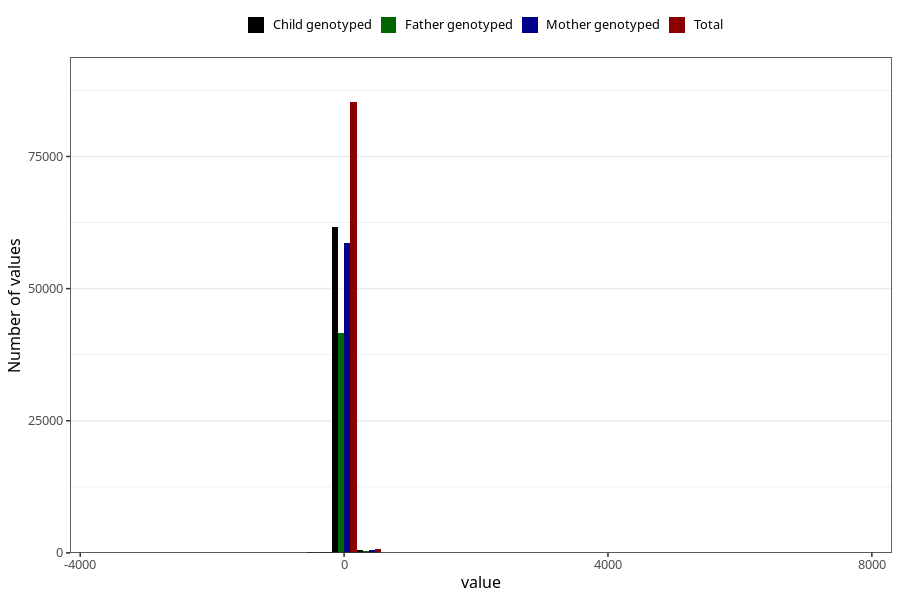

# age_3m
Variable mapping to questionnaire: q4, question ALDER3MND_SJEKK.
- Number of values:

| Value | Total | Child genotyped | Mother genotyped | Father genotyped |
| ----- | ----- | --------------- | ---------------- | ---------------- |
| Missing | 27377 | 13103 | 12413 | 8225 |
| Non-missing | 86246 | 62328 | 59356 | 41993 |
| 25th percentile | 90 | 90 | 90 | 90 |
| 50th percentile | 94 | 94 | 94 | 94 |
| 75th percentile | 99 | 99 | 99 | 98 |

