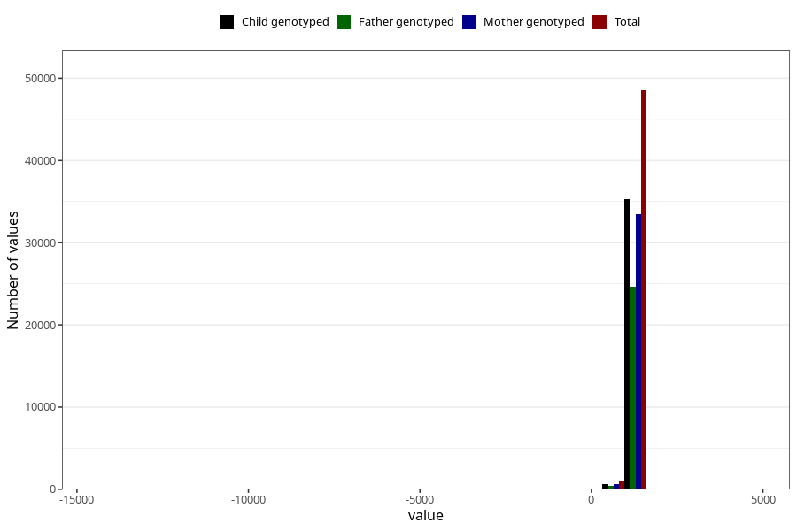

# age_3y
Variable mapping to questionnaire: q6, question Q6_AGE_3_Y.
- Number of values:

| Value | Total | Child genotyped | Mother genotyped | Father genotyped |
| ----- | ----- | --------------- | ---------------- | ---------------- |
| Missing | 64019 | 39403 | 37556 | 25037 |
| Non-missing | 49604 | 36028 | 34213 | 25181 |
| 25th percentile | 1096 | 1096 | 1096 | 1096 |
| 50th percentile | 1103 | 1103 | 1103 | 1103 |
| 75th percentile | 1119 | 1119 | 1119 | 1119 |

