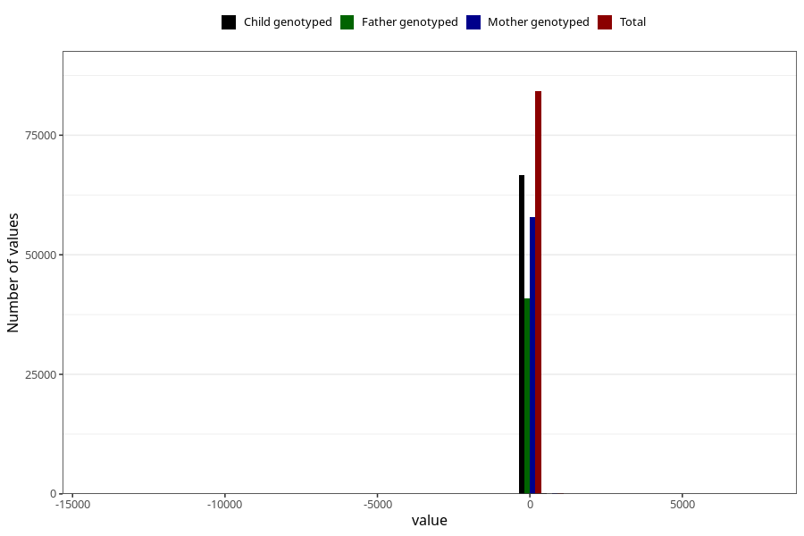

# age_6m
Variable mapping to questionnaire: q4, question ALDER6MND_SJEKK.
- Number of values:

| Value | Total | Child genotyped | Mother genotyped | Father genotyped |
| ----- | ----- | --------------- | ---------------- | ---------------- |
| Missing | 29253 | 16624 | 13779 | 9142 |
| Non-missing | 84370 | 66731 | 57990 | 41076 |
| 25th percentile | 167 | 167 | 167 | 167 |
| 50th percentile | 181 | 181 | 181 | 181 |
| 75th percentile | 187 | 187 | 187 | 187 |

