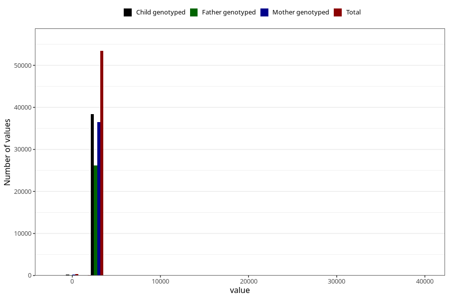

# age_7y
Variable mapping to questionnaire: q8, question AGE_MTHS_Q7.
- Number of values:

| Value | Total | Child genotyped | Mother genotyped | Father genotyped |
| ----- | ----- | --------------- | ---------------- | ---------------- |
| Missing | 59811 | 36767 | 35017 | 23912 |
| Non-missing | 53812 | 38664 | 36752 | 26306 |
| 25th percentile | 2556.75 | 2556.75 | 2556.75 | 2556.75 |
| 50th percentile | 2587.1875 | 2587.1875 | 2587.1875 | 2587.1875 |
| 75th percentile | 2617.625 | 2617.625 | 2617.625 | 2617.625 |

