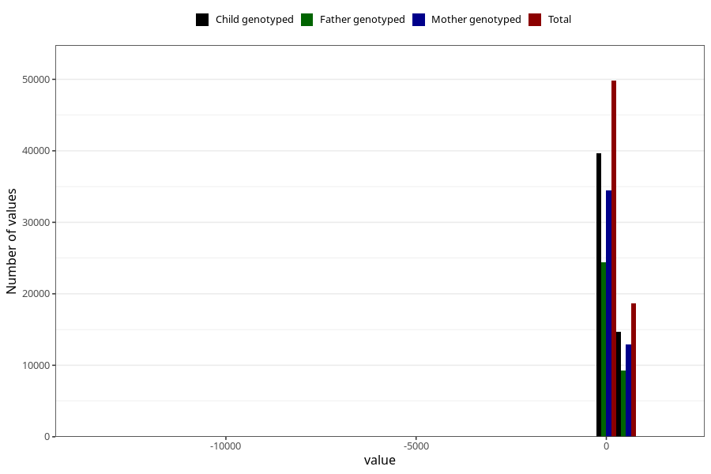

# age_8m
Variable mapping to questionnaire: q5, question Q5_AGE_8_M.
- Number of values:

| Value | Total | Child genotyped | Mother genotyped | Father genotyped |
| ----- | ----- | --------------- | ---------------- | ---------------- |
| Missing | 45120 | 29000 | 24350 | 16532 |
| Non-missing | 68503 | 54355 | 47419 | 33686 |
| 25th percentile | 234 | 234 | 234 | 234 |
| 50th percentile | 246 | 246 | 246 | 246 |
| 75th percentile | 261 | 260 | 260 | 261 |

