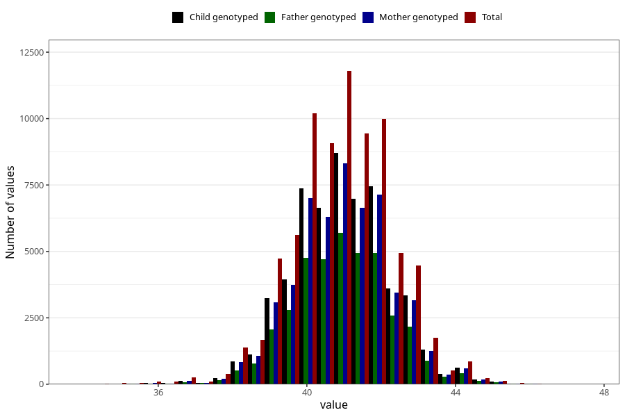

# hc_3m
Variable mapping to questionnaire: q4, question DD220.
- Number of values:

| Value | Total | Child genotyped | Mother genotyped | Father genotyped |
| ----- | ----- | --------------- | ---------------- | ---------------- |
| Missing | 35675 | 19030 | 18074 | 12103 |
| Non-missing | 77948 | 56401 | 53695 | 38115 |
| 25th percentile | 40 | 40 | 40 | 40 |
| 50th percentile | 41 | 41 | 41 | 41 |
| 75th percentile | 42 | 42 | 42 | 42 |

