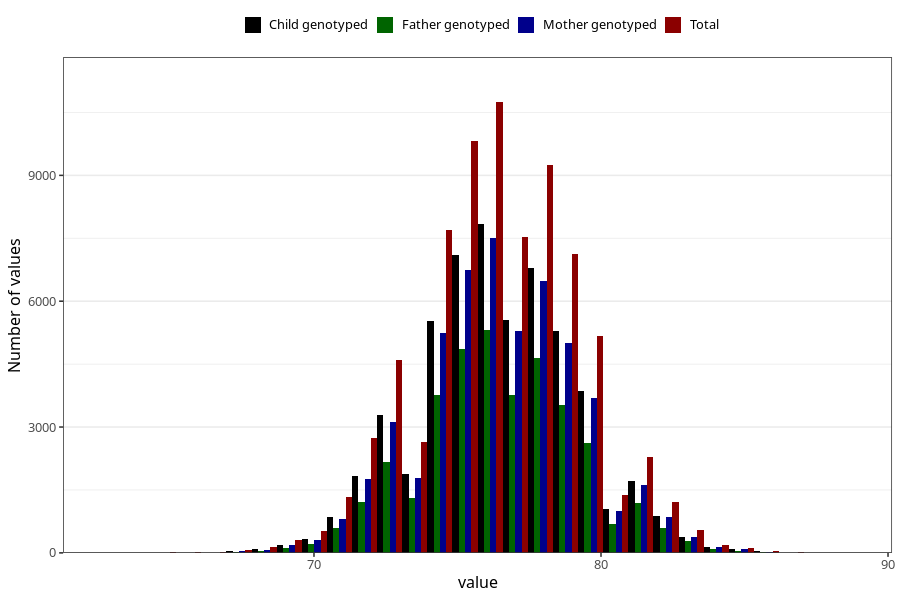

# length_1y
Variable mapping to questionnaire: q5, question EE393.
- Number of values:

| Value | Total | Child genotyped | Mother genotyped | Father genotyped |
| ----- | ----- | --------------- | ---------------- | ---------------- |
| Missing | 38119 | 23541 | 19659 | 13108 |
| Non-missing | 75504 | 59814 | 52110 | 37110 |
| 25th percentile | 74.5 | 74.5 | 74.5 | 74.5642250584676 |
| 50th percentile | 76.5 | 76.5 | 76.5 | 76.5 |
| 75th percentile | 78 | 78 | 78.0961293967153 | 78.0108856618122 |

