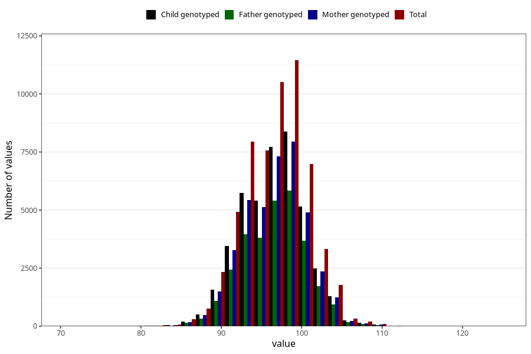

# length_3y
Variable mapping to questionnaire: q6, question GG25.
- Number of values:

| Value | Total | Child genotyped | Mother genotyped | Father genotyped |
| ----- | ----- | --------------- | ---------------- | ---------------- |
| Missing | 54930 | 33003 | 31482 | 20486 |
| Non-missing | 58693 | 42428 | 40287 | 29732 |
| 25th percentile | 94 | 94 | 94 | 94 |
| 50th percentile | 96.7974027660077 | 97 | 97 | 97 |
| 75th percentile | 99 | 99 | 99 | 99 |

