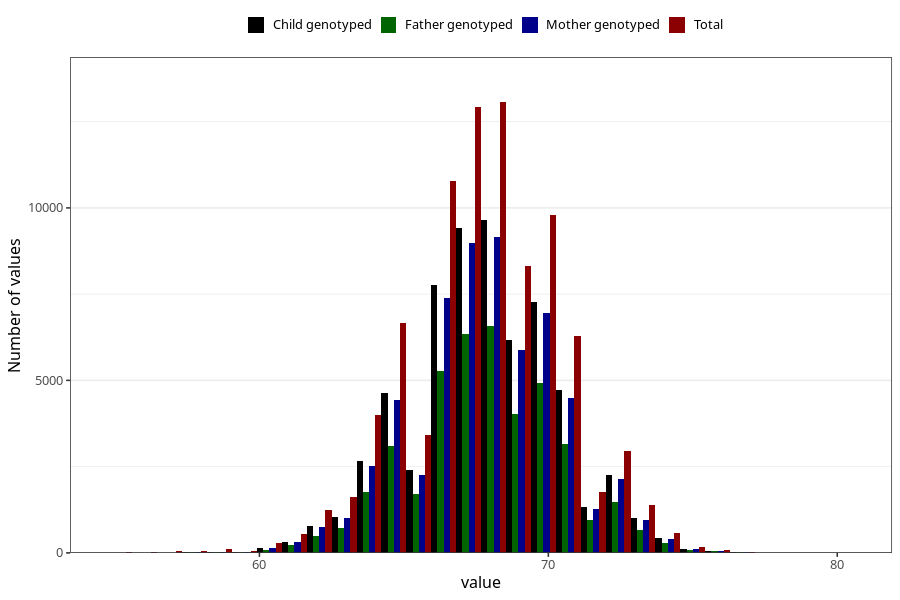

# length_6m
Variable mapping to questionnaire: q4, question DD225.
- Number of values:

| Value | Total | Child genotyped | Mother genotyped | Father genotyped |
| ----- | ----- | --------------- | ---------------- | ---------------- |
| Missing | 27391 | 13124 | 12434 | 8227 |
| Non-missing | 86232 | 62307 | 59335 | 41991 |
| 25th percentile | 66 | 66 | 66 | 66 |
| 50th percentile | 68 | 68 | 68 | 68 |
| 75th percentile | 69.5 | 69.5 | 69.5 | 69.5 |

