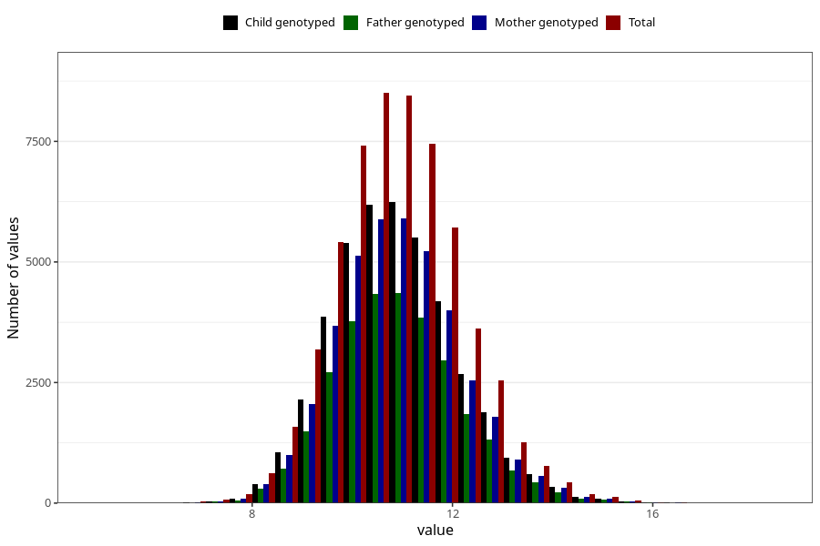

# weight_16m
- Number of values:

| Value | Total | Child genotyped | Mother genotyped | Father genotyped |
| ----- | ----- | --------------- | ---------------- | ---------------- |
| Missing | 55964 | 33583 | 32010 | 20951 |
| Non-missing | 57659 | 41848 | 39759 | 29267 |
| 25th percentile | 10.03 | 10.072985795901 | 10.0707566243921 | 10.08 |
| 50th percentile | 10.83 | 10.8609503133163 | 10.86 | 10.86 |
| 75th percentile | 11.68 | 11.7 | 11.7 | 11.7 |

