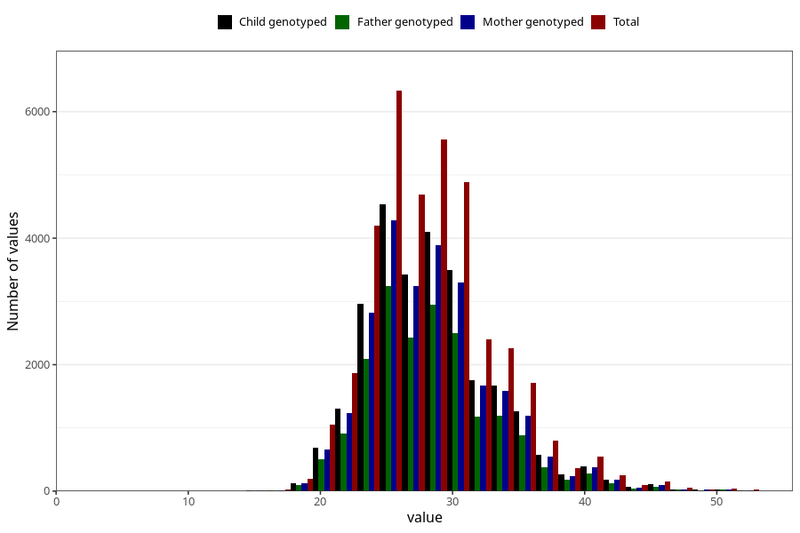

# weight_8y
Variable mapping to questionnaire: q9, question NN25.
- Number of values:

| Value | Total | Child genotyped | Mother genotyped | Father genotyped |
| ----- | ----- | --------------- | ---------------- | ---------------- |
| Missing | 76105 | 48401 | 46168 | 31067 |
| Non-missing | 37518 | 27030 | 25601 | 19151 |
| 25th percentile | 25 | 25 | 25 | 25 |
| 50th percentile | 28 | 28 | 28 | 28 |
| 75th percentile | 31 | 31 | 31 | 31 |

