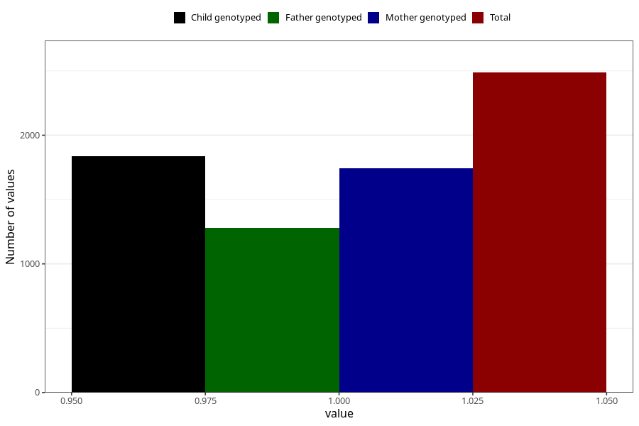

# accidental_injury_with_subsequent_medical_treatment_8y
Variable mapping to questionnaire: q9, question NN32.
- Number of values:

| Value | Total | Child genotyped | Mother genotyped | Father genotyped |
| ----- | ----- | --------------- | ---------------- | ---------------- |
| Missing | 111136 | 73592 | 70024 | 48938 |
| Non-missing | 2487 | 1839 | 1745 | 1280 |
| 1 | 2487 | 1839 | 1745 | 1280 |

