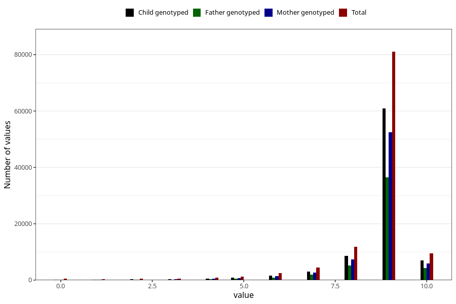

# apgar_1
Variable mapping to questionnaire: mfr, question APGAR1.
- Number of values:

| Value | Total | Child genotyped | Mother genotyped | Father genotyped |
| ----- | ----- | --------------- | ---------------- | ---------------- |
| Missing | 493 | 99 | 80 | 45 |
| Non-missing | 113130 | 83256 | 71689 | 50173 |
| 0 | 505 | 95 | 83 | 56 |
| 1 | 305 | 140 | 114 | 78 |
| 2 | 468 | 265 | 210 | 162 |
| 3 | 579 | 325 | 280 | 215 |
| 4 | 848 | 522 | 460 | 317 |
| 5 | 1313 | 853 | 723 | 518 |
| 6 | 2414 | 1597 | 1351 | 938 |
| 7 | 4402 | 3073 | 2655 | 1928 |
| 8 | 11781 | 8524 | 7341 | 5217 |
| 9 | 81020 | 60890 | 52524 | 36463 |
| 10 | 9495 | 6972 | 5948 | 4281 |

